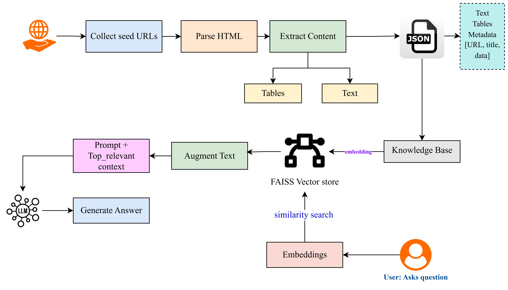

# Bank-of-Maharashtra-Loan-Product-Assistant

An AI-powered assistant that answers questions about Bank of Maharashtra loan offerings using a Retrieval-Augmented Generation (RAG) pipeline. This project includes a polite web scraper, chunking pipeline, FAISS-based vector search, a Groq LLM for generation, and a FastAPI + HTML/CSS frontend.

## 🚀 Quick Start

### 1. Clone & create a virtual env

```bash
git clone https://github.com/Yashashree125/Bank-of-Maharashtra-Loan-Product-Assistant
cd Bank-of-Maharashtra-Loan-Product-Assistant
python -m venv .venv
# Linux/Mac
source .venv/bin/activate
# Windows
.venv\Scripts\activate
```

### 2. Install dependencies

```bash
pip install -r requirements.txt
```

### 3. Configure environment

Create a **.env** file in the project root (do not commit this file):

```ini
GROQ_API_KEY=your_groq_api_key_here
MODEL_NAME=sentence-transformers/all-MiniLM-L6-v2
LLM_MODEL=openai/gpt-oss-120b
FAISS_DIR=output/faiss_index
```

### 4. Scrape pages (optional – if you need fresh data)

Prepare `seed_urls.txt` (one URL per line), then run:

```bash
python scraper.py
```

Outputs:

* `output/pages/` – saved HTML snapshots
* `output/tables/` – CSVs extracted from HTML tables
* `output/loan_data.jsonl` – structured page data

### 5. Chunk the scraped text

```bash
python chunking.py
```

Outputs:

* `output/loan_chunks.jsonl`

### For Loan Product Assistant - Run the FastAPI app

```bash
uvicorn app.main:app --reload
```
 
[](https://drive.google.com/file/d/1aB_HJ9GMxly-Se6ng7i4AiY8bHS9znjv/view?usp=sharing)


---
## 🛠️ Tech Stack

- **FastAPI** → Backend framework
- **LangChain** → RAG orchestration (retriever + LLMChain)
- **FAISS** → Vector database for embeddings
- **HuggingFace Transformers** → Embeddings model
- **Groq LLM** → Language model
- **Jinja2 + HTML/CSS** → Frontend
- **Markdown2** → Answer formatting

---

## 🧠 Architectural Decisions



### Why FastAPI + HTML/CSS?

* **FastAPI** is lightweight, fast, and easy to deploy; provides form submission and templating through Jinja2.
* **Server-side rendered HTML** keeps the stack simple for a POC and avoids CORS issues.

### RAG Design

The **RAG pipeline** is powered by **LangChain**, a framework that helps orchestrate various components of the pipeline. **LangChain** integrates the following:

- **Retriever**: Uses **FAISS** for fast semantic search.
- **Augmentation**: Concatenates the retrieved chunks and provides them as context to the language model.
- **Generator**: **Groq LLM** is used to generate answers based on the user query and augmented context.

LangChain simplifies the orchestration of these components into a seamless flow, ensuring efficient query processing and response generation.

### Output Formatting

The response is generated in **Markdown** format, then converted to **HTML** using **markdown2** and rendered on the frontend.


---

## 📚 Libraries & Why

### Scraping

* `requests` – robust HTTP client.
* `BeautifulSoup4` + `lxml` – reliable parsing of HTML structure.
* `pandas.read_html` – quick extraction of tabular data to CSV.

### Data Processing

* `re`, `json`, `hashlib` – cleaning, serialization, deterministic IDs from URLs.

### RAG Pipeline

* `sentence-transformers` – `all-MiniLM-L6-v2` for fast, competitive sentence embeddings.
* `faiss-cpu` – high‑performance vector search on CPU.
* `langchain` - Orchestrates the retrieval, augmentation, and generation steps in the RAG pipeline.
* `groq` – call the Groq LLM (`openai/gpt-oss-120b`) for answer generation.

### App & UX

* `fastapi`, `uvicorn` – API server & dev reloader.
* `jinja2` – templating for the UI.
* `markdown2` – render Markdown output from LLM to HTML for bold/italics/lists.
* `python-dotenv` – load secrets/config from `.env`.

---

## 📑 Data Strategy (Chunking)

* **Chunk size**: `400` words
* **Overlap**: `50` words

**Rationale**

* Loan documents span definitions, eligibility, and rate details across multiple sentences/sections. Overlap preserves continuity so critical terms aren’t split across chunks.
* 400‑word chunks strike a balance between **retrieval precision** (narrow scope) and **context coverage** (enough surrounding info for the LLM).

---

## 🤖 Model Selection

* **Embedding model**: `sentence-transformers/all-MiniLM-L6-v2`

  * Small, fast, and strong for semantic search in English; excellent for CPU inference at POC scale.
* **LLM**: `openai/gpt-oss-120b` via **Groq**

  * Deterministic settings (low temperature) for factual, concise answers constrained to the provided context.

---

## ⚠️ Challenges & Solutions

1. **Dynamic/JS-heavy pages**: Focused on static loan/product pages; filtered links heuristically (`loan|interest|maha-super`).
2. **Messy table formats**: Used `pandas.read_html` and saved as CSV, preserving rate slabs and eligibility data for future structured use.
3. **Noisy HTML**: Stripped non‑content tags (script/style/nav/header/footer) and extracted only headings/paras/lists.
4. **Duplicate/near‑duplicate content**: Deterministic URL hashing for file names; simple visited‑set to avoid re-fetching.
5. **Answer Length**:Sometimes responses were verbose; solved by prompt engineering with instructions like “Answer in concise form”.
6. **Response formatting**: LLM returned Markdown; rendered it as HTML via `markdown2` and `{{ answer | safe }}` to avoid raw `**` and `*` showing up.

---

## 🔭 Potential Improvements

* **Freshness**: Scheduled scraping (cron) + incremental re‑indexing.
* **Table‑aware retrieval**: Embed tables separately; optionally serialize as Markdown for better retrievability.
* **Hybrid search**: Combine keyword + vector search; add metadata filters (product type, date, source page).
* **Caching**: Cache embeddings and query results to reduce latency.
* **Conversation memory**: Maintain short session memory to support follow‑ups (without switching stacks).


